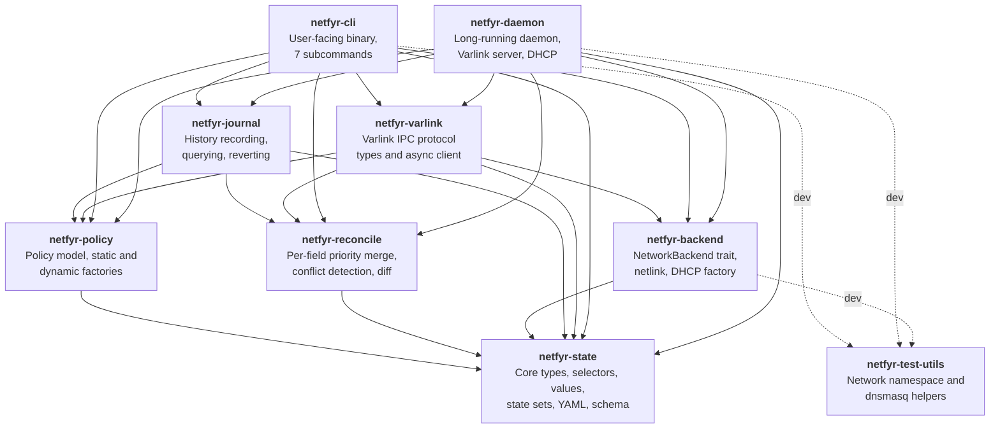
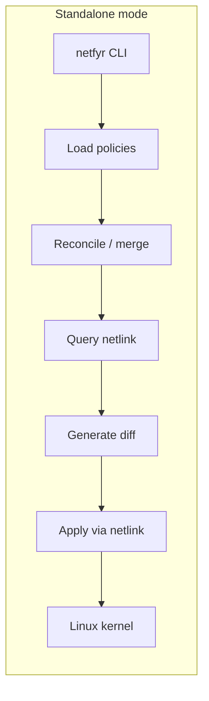
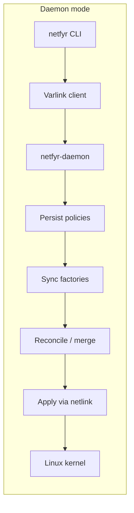
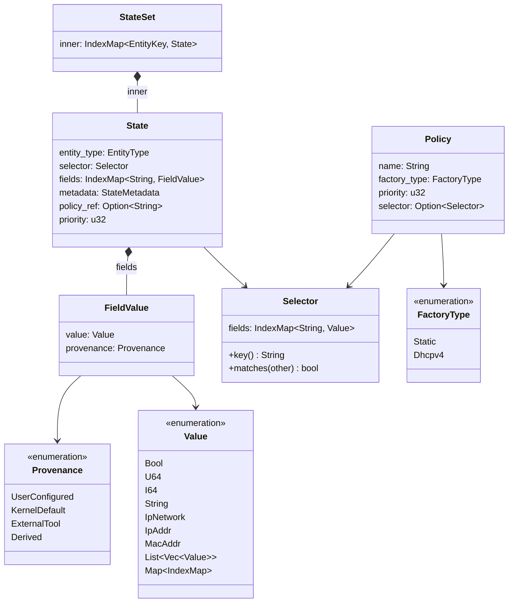

# Architecture

netfyr is a declarative network configuration tool for Linux. Users describe desired network state in YAML policy files; netfyr diffs that against live kernel state and applies the necessary changes. The project is a Rust workspace with nine crates arranged in layers, where each layer depends only on layers below it.

## Crate dependency graph

## Layers

**Layer 0 — Foundation: `netfyr-state`.**
The types everything else depends on. Defines `State` (a set of typed fields describing one network entity), `Selector` (matches entities by name, type, driver, PCI path, MAC, or labels), `Value` (a rich union type with IP-aware parsing), `FieldValue` (value paired with provenance), and `StateSet` (a collection keyed by entity type and selector). Also owns the `SchemaRegistry` which loads embedded JSON schemas for validation.

**Layer 1 — Domain logic: `netfyr-policy`, `netfyr-reconcile`.**
`netfyr-policy` defines the `Policy` model (name, factory type, priority, state) and the `StateFactory` trait that produces a `StateSet` from a policy. Two factories exist: `StaticFactory` (inline YAML) and `Dhcpv4Factory` (runtime DHCP lease).
`netfyr-reconcile` implements the per-field priority merge algorithm: given multiple policies targeting the same entity, each field is won by the highest-priority policy. When top-priority policies disagree on a field's value, it is reported as a conflict and omitted from the effective state. Also provides `generate_diff` to compute field-level diffs between two `StateSet` values.

**Layer 2 — I/O: `netfyr-backend`, `netfyr-journal`, `netfyr-varlink`.**
`netfyr-backend` defines the `NetworkBackend` async trait (query, apply, dry-run) and provides a netlink-based implementation that talks to the Linux kernel. It also contains the `Dhcpv4Factory` which spawns a DHCP client and publishes leases as `State`.
`netfyr-journal` records every apply operation as a `JournalEntry` in an append-only NDJSON file, supporting history queries and state revert.
`netfyr-varlink` defines the Varlink IPC protocol (request/response types, async client) used for CLI-to-daemon communication over a Unix socket.

**Layer 3 — Binaries: `netfyr-cli`, `netfyr-daemon`.**
`netfyr-cli` is the user-facing `netfyr` binary with subcommands: `apply`, `query`, `history`, `revert`, `diagnose`, `show`, `completions`.
`netfyr-daemon` is a long-lived process that manages policy lifecycle, serves the Varlink API, runs DHCP factories, monitors netlink for external changes, and journals all state mutations.

**Testing: `netfyr-test-utils`.**
Shared helpers for integration tests: `NetnsGuard` (sets up unprivileged user+network namespaces), `DnsmasqGuard` (runs a DHCP server), and veth pair creation. Used as a dev-dependency by `netfyr-cli`, `netfyr-daemon`, and `netfyr-backend`.

## Two-mode architecture

netfyr operates in one of two modes, detected automatically by trying to connect to the daemon socket:

In **standalone mode**, the CLI loads static policies directly, reconciles them, and applies via netlink. No daemon is needed. This mode does not support dynamic factories (DHCPv4).

In **daemon mode**, the CLI submits policies over Varlink. The daemon persists them to disk, syncs DHCP factories, runs reconciliation, applies, and journals the result. The daemon also monitors netlink for external changes and records them passively.

## Data model

## Key concepts

| Concept | Crate | Description |
|---------|-------|-------------|
| **State** | `netfyr-state` | A set of typed fields describing one network entity (e.g. an ethernet interface with MTU, addresses, routes). |
| **Selector** | `netfyr-state` | Matches entities by name, type, driver, PCI path, MAC, or labels. All criteria use AND logic for stable hardware identification across reboots. |
| **Value** | `netfyr-state` | Rich union type supporting booleans, integers, IP addresses/networks, MAC addresses, strings, lists, and maps. Custom YAML deserializer parses strings as IP addresses when appropriate. |
| **FieldValue** | `netfyr-state` | A `Value` paired with `Provenance` — tracks whether the value was user-configured, a kernel default, set by an external tool, or derived. |
| **StateSet** | `netfyr-state` | Collection of `State` values keyed by `(entity_type, selector.key())`. |
| **SchemaRegistry** | `netfyr-state` | Loads embedded JSON schemas (`ethernet.json`, `ip.json`, `link.json`) and validates state fields for type correctness and writability. |
| **Policy** | `netfyr-policy` | Named factory that produces a `StateSet`. Carries a priority, a factory type (static or DHCPv4), and either inline state or a selector for dynamic factories. |
| **StateFactory** | `netfyr-policy` | Trait implemented by `StaticFactory` and `Dhcpv4Factory` to produce `StateSet` from a policy definition. |
| **Reconciliation** | `netfyr-reconcile` | Per-field priority merge across multiple policies. Each field is independently won by the highest-priority policy. |
| **Conflict** | `netfyr-reconcile` | When two policies at the same priority set the same field to different values. Conflicts are reported explicitly and the field is omitted from the effective state. |
| **StateDiff** | `netfyr-reconcile` | Field-level diff between two `StateSet` values, with operations: Add, Remove, Modify (with per-field changes). |
| **NetworkBackend** | `netfyr-backend` | Async trait for querying and applying network state. Currently implemented by `NetlinkBackend`. |
| **JournalEntry** | `netfyr-journal` | Records one apply operation: sequence ID, timestamp, trigger type, active policies, field-level diff, state-after snapshot, and apply outcome. |
| **Trigger** | `netfyr-journal` | What caused a journal entry: `DaemonStartup`, `Apply` (user), `ExternalChange`, or `Revert`. |
| **Varlink** | `netfyr-varlink` | IPC protocol over Unix socket using NUL-terminated JSON messages. 8 RPC methods for policy submission, query, dry-run, status, history, revert, and show. |
