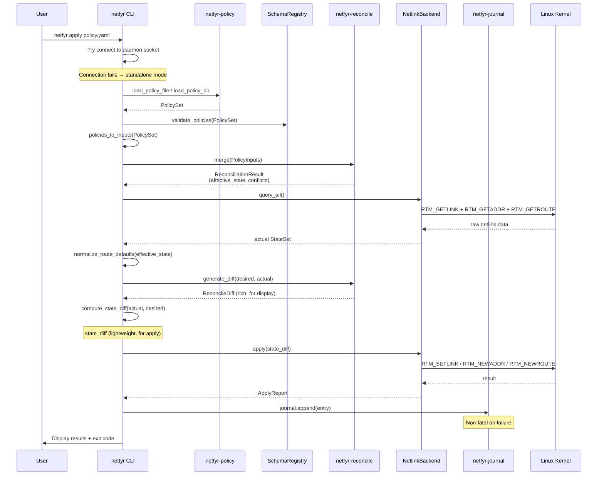
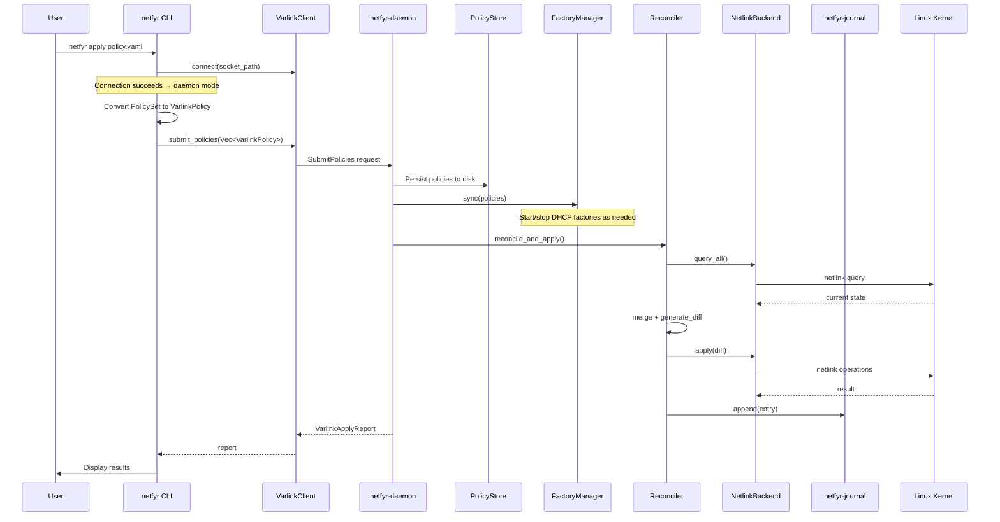
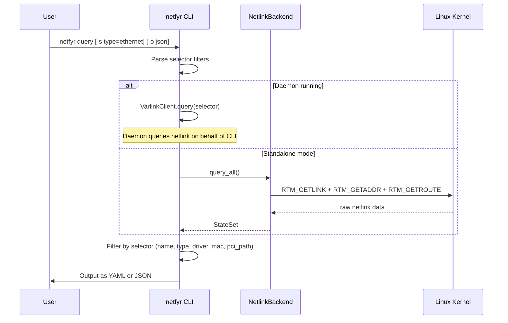
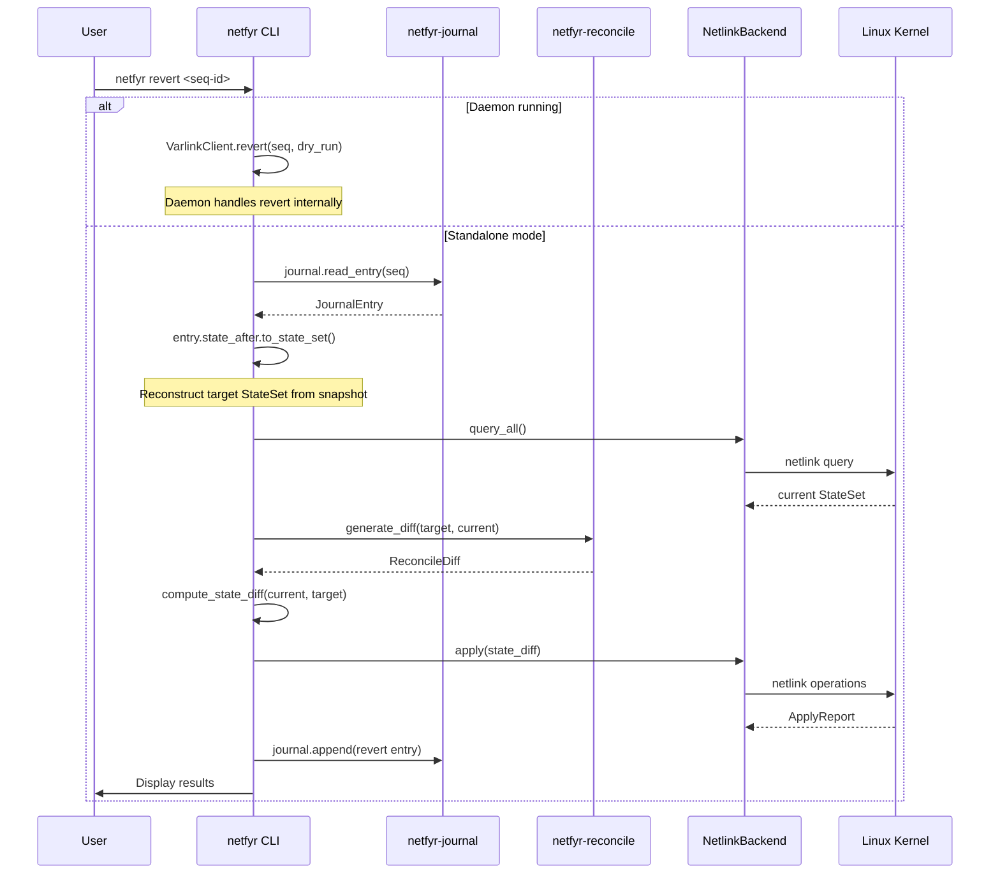
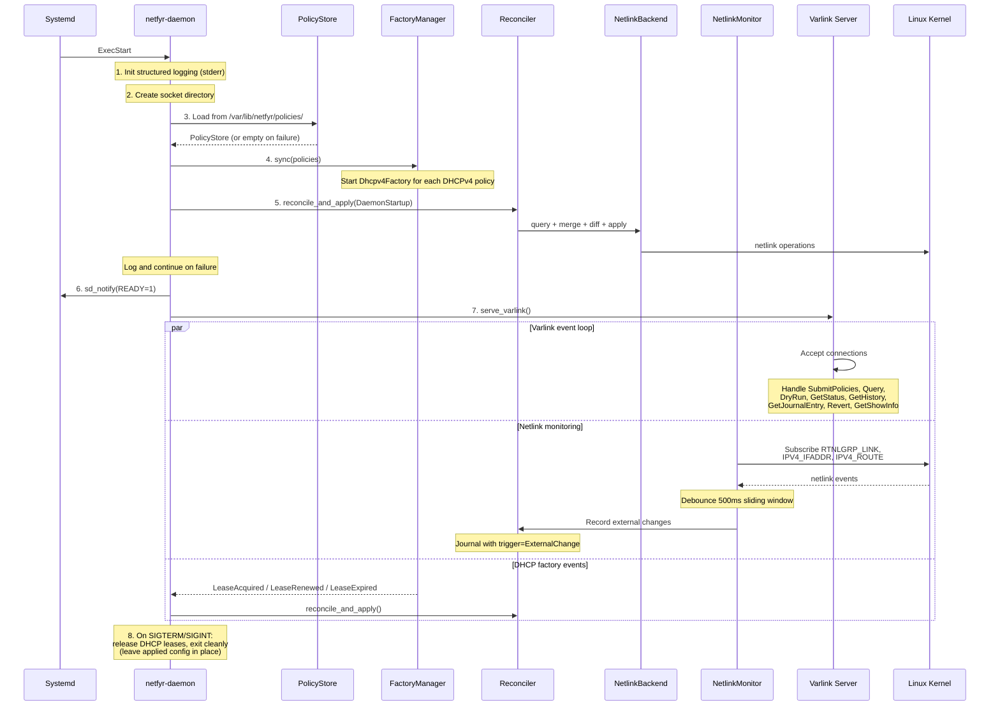
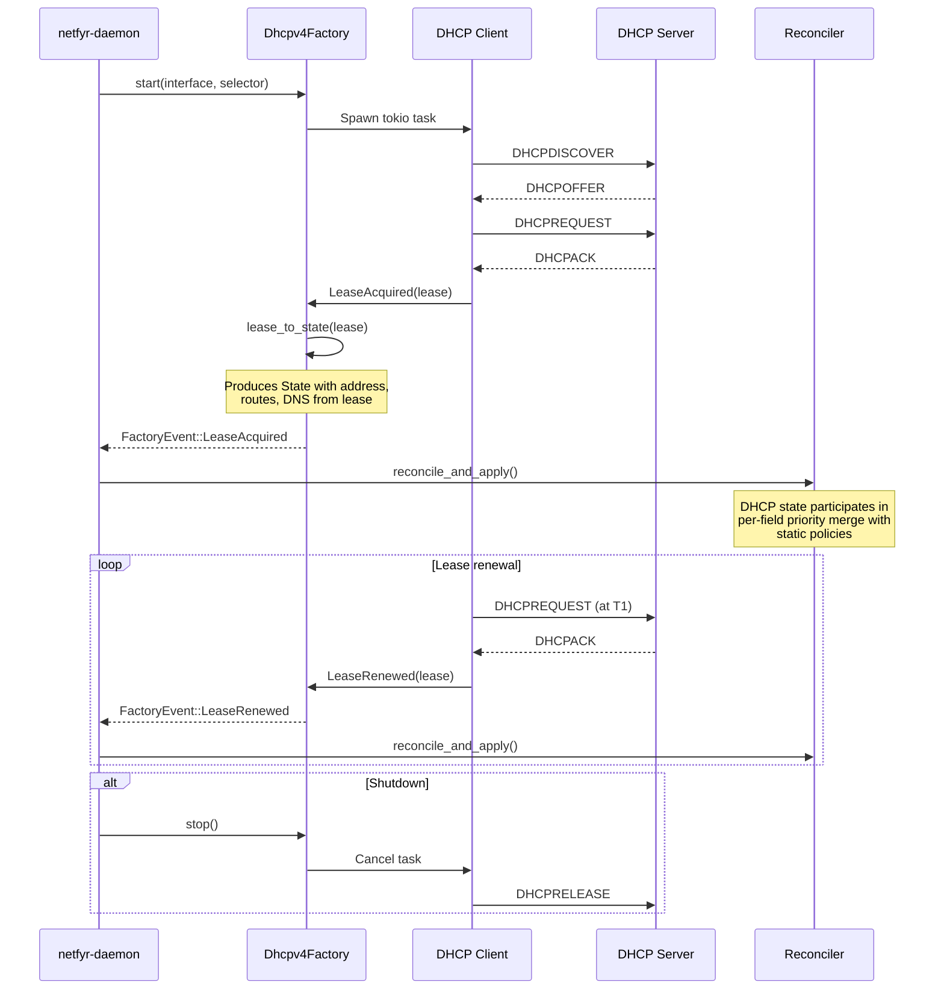

# Workflows

Sequence diagrams for the main operations in netfyr. Each operation auto-detects whether the daemon is running by trying to connect to the Varlink socket; if the connection fails, the operation runs in standalone mode.

## Apply (standalone mode)

The CLI loads policies, reconciles them, queries live kernel state, computes a diff, and applies directly via netlink. Non-static policies (e.g. DHCPv4) are rejected in this mode.

## Apply (daemon mode)

The CLI submits policies over Varlink. The daemon persists them, syncs DHCP factories, runs reconciliation, applies, and journals.

## Query

Queries live kernel state, optionally filtered by selector. In daemon mode the query goes through Varlink; in standalone mode it queries netlink directly.

## Revert

Restores system state to match a journal entry's `state_after` snapshot. Computes a diff between current kernel state and the target snapshot, then applies.

## Daemon startup

The daemon initializes logging, loads persisted policies, starts DHCP factories, runs an initial reconciliation, notifies systemd, and enters the Varlink event loop. Failures at each step are logged but do not prevent the daemon from starting.

## DHCP lease lifecycle

When a DHCPv4 policy is submitted, the daemon starts a DHCP factory that spawns a client. Lease events trigger reconciliation, incorporating DHCP-acquired state into the priority merge alongside static policies.

